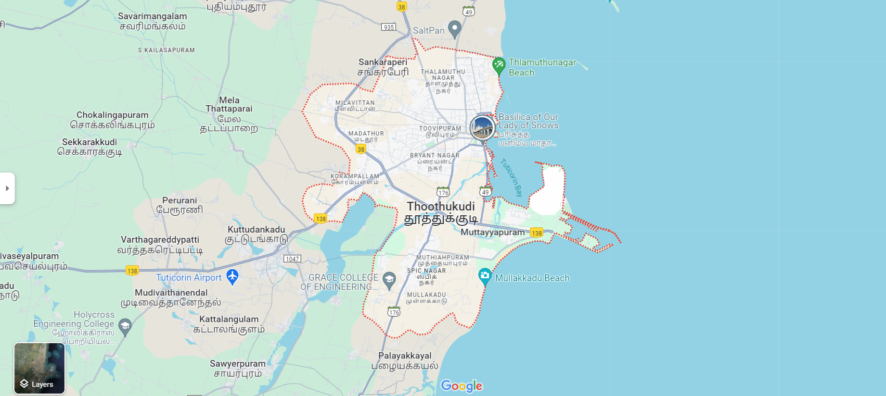

# Ex04 Places Around Me
## Date: 13-05-2024

## AIM
To develop a website to display details about the places around my house.

## DESIGN STEPS

### STEP 1
Create a Django admin interface.

### STEP 2
Download your city map from Google.

### STEP 3
Using ```<map>``` tag name the map.

### STEP 4
Create clickable regions in the image using ```<area>``` tag.

### STEP 5
Write HTML programs for all the regions identified.

### STEP 6
Execute the programs and publish them.

## CODE
```
map.html

<html>
<head>
<title>Arivazhagan G R map</title>
</head>
<body align="center" bgcolor="lightblue">
<h1 align="center">
<font color="black"><b>Thoothukoodi(Famous for salt production)</b></font>
</h1>
<h3 align="center">
<font color="black"><b>-Arivazhagan G R (212223040020)</b></font>
</h3>

<map name="image-map">
        <area target="" alt="madathur" title="madathur" href="madathur.html" coords="715,269,808,306" shape="rect">
        <area target="" alt="beach" title="beach" href="beach.html" coords="1014,118,1219,160" shape="rect">
        <area target="" alt="college" title="college" href="college.html" coords="619,563,824,615" shape="rect">
        <area target="" alt="mullakadu" title="mullakadu" href="mullakadu.html" coords="990,555,1188,605" shape="rect">
    </map>
</body>
</html>

mullakadu.html

<html>
    <head>
        <title>mullakadu</title>
    </head>
    <body bgcolor="orange"><center>
        <h1>Mullakadu</h1>
        <hr>
        <br>
        <p>
            Mullakadu is a coastal village located in the Thoothukudi district of Tamil Nadu, India. It is renowned for its scenic beaches and vibrant fishing community, contributing to the region's rich cultural and economic tapestry.
        </p>
    </center>
    </body>
</html>

college.html

<html>
    <head>
        <title>Grace engineering college</title>
    </head>
    <body bgcolor="red"><center>
        <h1>Grace engineering college</h1>
        <hr>
        <br>
        <p>
            Grace Engineering College is a leading institution known for its focus on excellence in engineering education. Situated in a serene campus setting, it offers state-of-the-art facilities and a dynamic learning environment conducive to academic growth and innovation.
        </p>
    </center>
    </body>
</html>

beach.html

<html>
    <head>
        <title>Muthu nagar beach</title>
    </head>
    <body bgcolor="cyan"><center>
        <h1>Muthu nagar beach</h1>
        <hr>
        <br>
        <p>
            Muthunagar Beach is a picturesque coastal stretch nestled along the shores of Tamil Nadu, India. With its golden sands and tranquil waters, it provides a serene retreat for visitors seeking relaxation and natural beauty.
        </p>
    </center>
    </body>
</html>

madathur.html

<html>
    <head>
        <title>Madathur beach</title>
    </head>
    <body bgcolor="blue"><center>
        <h1>Madathur beach</h1>
        <hr>
        <br>
        <p>
            Madathur Beach is a scenic coastal spot in the Thoothukudi district of Tamil Nadu, India, known for its pristine sands and clear blue waters. Surrounded by lush greenery, it offers a peaceful escape for beach lovers and nature enthusiasts alike.
        </p>
    </center>
    </body>
</html>
```
## OUTPUT



## RESULT
The program for implementing image maps using HTML is executed successfully.
